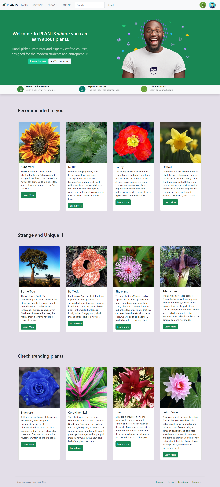
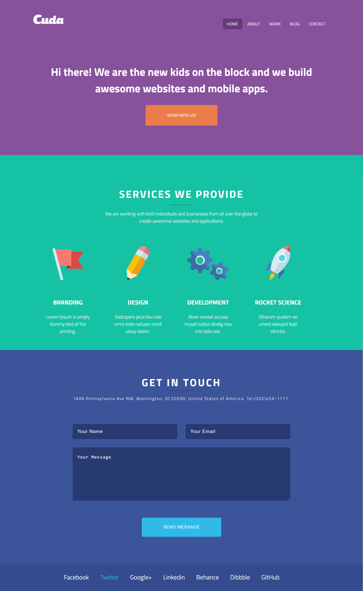

# Quick Introduction
<h2> This webpage was made using HTML, CSS and Bootstrap. It is a fully responsive webpage, It mimics a blog website where you can learn new and interesting things about plants.
</h2>
 
<h3> If you would like to check out the website yourself,open the IDE and type <strong> python3 -m http.server </strong> in the terminal window. </h3>

 

# Cuda Project

<h2> What is the Cuda Project? </h2>

<h3> The Cuda Project is a website internally made out of CSS and HTML with no bootstrap. The purpose of this webpage is to showcase my HTML and CSS skills. This webpage was designed by Christopher Dodd you can find him on skillshare.
</h3>

 

<strong> <h4> To open this webpage you need to open the plant's page and then open the pages tab in the navigation, there you will see the Cuda Project on the list below.</h4> </strong>

