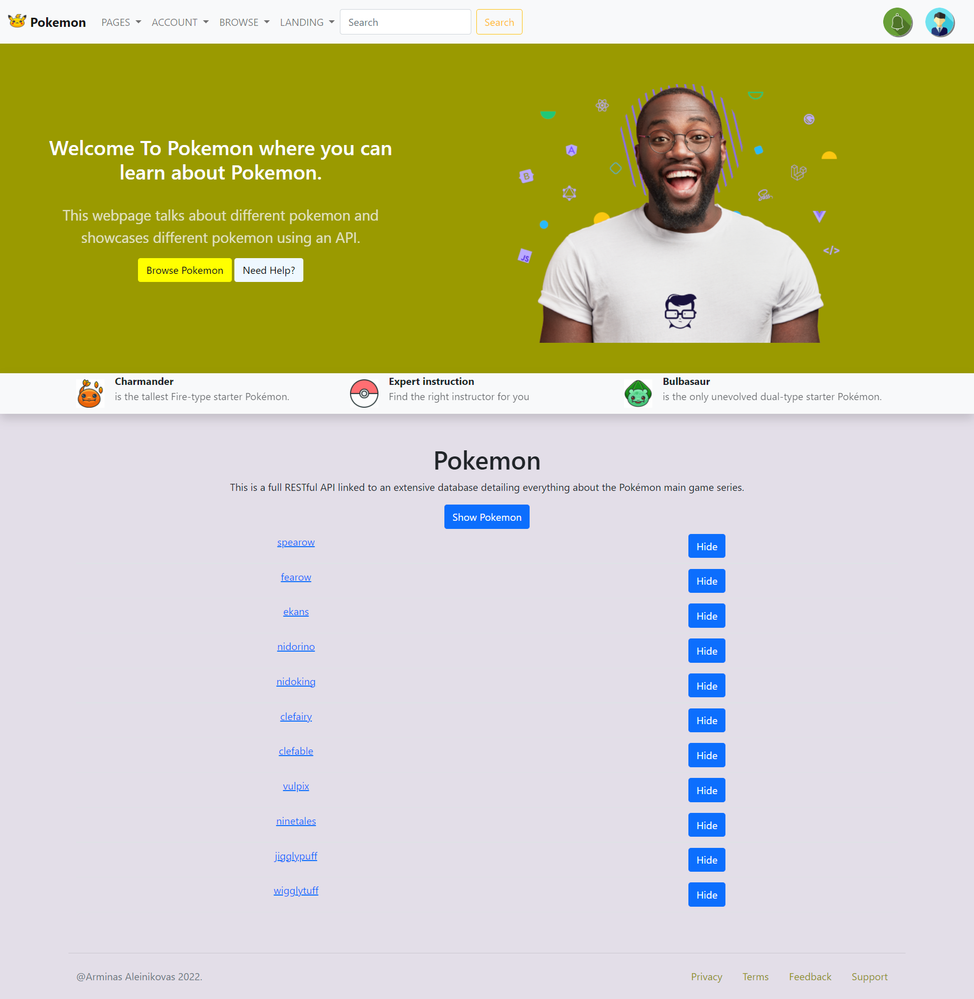
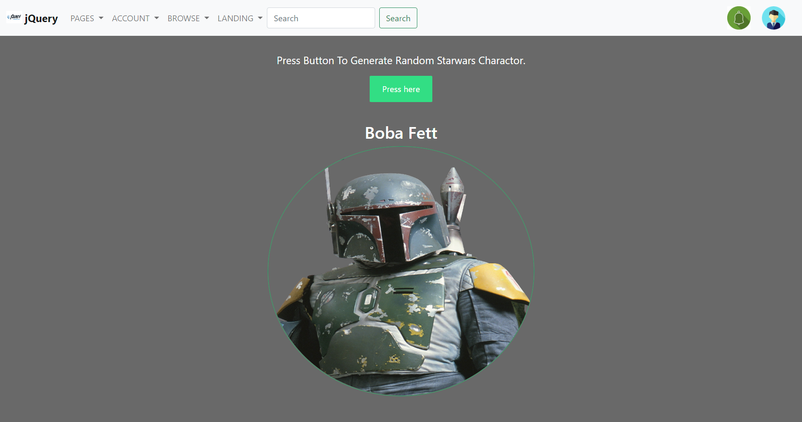
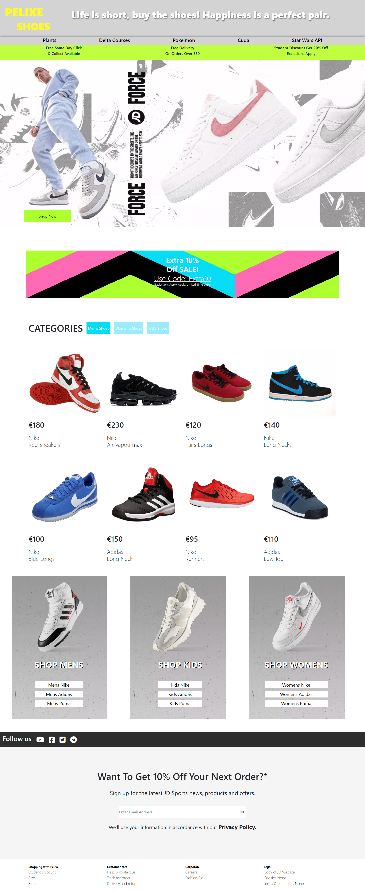
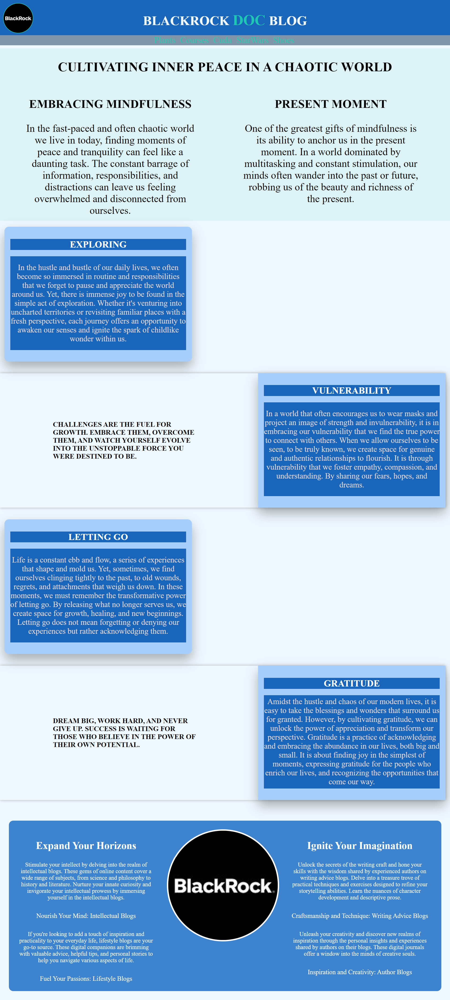
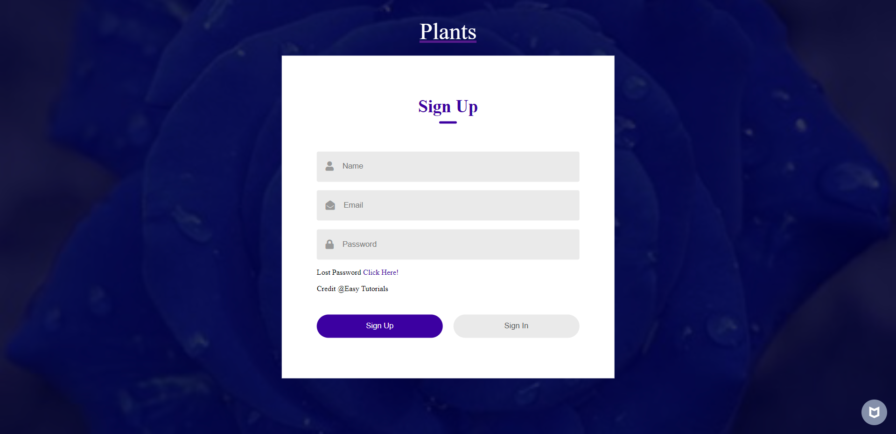

# Quick Introduction
<h2> This webpage was made using HTML, CSS and Bootstrap. It is a fully responsive webpage, It mimics a blog website where you can learn new and interesting things about plants.
</h2>
 
<h3> If you would like to check out the website yourself,open the IDE and type <strong> python3 -m http.server </strong> in the terminal window. </h3>

 

# Cuda Project

<h2> What is the Cuda Project? </h2>

<h3> The Cuda Project is a website internally made out of CSS and HTML with no bootstrap. The purpose of this webpage is to showcase my HTML and CSS skills. This webpage was designed by Christopher Dodd you can find him on skillshare.
</h3>

 

<strong> <h4> To open this webpage you need to open the plant's page and then open the pages tab in the navigation, there you will see the Cuda Project on the list below.</h4> </strong>

# JavaScript Project

<h2> What is the JavaScript Project? </h2>

<h3> The JavaScript Project is a website that contains a restful api, JavaScipt and jQuery. This webpage dononstrains my skills and knowledge of apis. 
</h3>

 

<strong> <h4> To open this webpage you need to open the plant's page and then open the Browse tab in the navigation, there you will see Pokemon List on the list below. Thats where this project will be </h4> </strong>

<strong> <h5> P.S Download Jsonview for a better experience. </h5> </strong>

# jQuery Page

<h2> What does the jQuery page do? </h2>

<h3> The jQuery page loads randomized Starwars characters onto the user page. This is done by using an API. I created this to showcase what I can do using jQuery, you will see I have tried many things on this page a lot of the code is unused but it's there for you to see. 
</h3>

 

<strong> <h4> To open this webpage you need to open the plant's page and then open the Browse tab in the navigation, there you will see the jQuery Page on the list below. That's where you will find this page. </h4> </strong>

# Delta Courses

<h2> What is Delta Courses? </h2>

<h3> This webpage showcases the front page of a website that advertises programming courses. </h3>

<strong> <h4> To open this webpage you need to open the plant's page and then open the 'Pages' tab in the navigation, there you will see the link for Courses. </h4> </strong>

# Pelixe Shoe Store

<h2> What is Pelixe Shoe Store? </h2>

<h3> Pelixe is a shoe store inspired by the JD online Clothing store. It showcases different shoes created by popular brands like Nike, Adidas, and Puma.  </h3>

<strong> <h4> To open this webpage you need to open the plant's page and then open the 'Pages' tab in the navigation, there you will see the link for 'shoes'. </h4> </strong>

# Blackrock Doc Blog Webpage

<h2> What is  Blackrock Doc Blog Webpage? </h2>

<h3>  Blackrock Doc Blog is a webpage focused on blog cards and different colors/designs that I rarely use. Its function is to be able to showcase a user an upbeat positive blog post.    </h3>

<strong> <h4> To open this webpage you need to open the plant's page and then open the 'More' tab in the navigation, there you will see the link for 'blog'. </h4> </strong>

# Registration Form

<h2> Why showcase a Registration Form? </h2>

<h3>  Showing what kind of registration form I can create using simple HTML and CSS only, shows off my skills using only CSS and HTML to create certain components.   </h3>

<strong> <h4> To get to this registration form you will need to open the plant's page and then open the 'More' tab in the navigation, there you will see the link for 'Register'. </h4> </strong>

